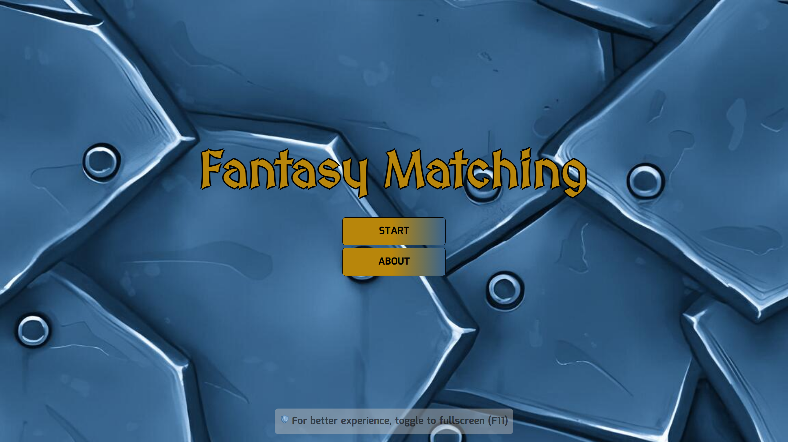
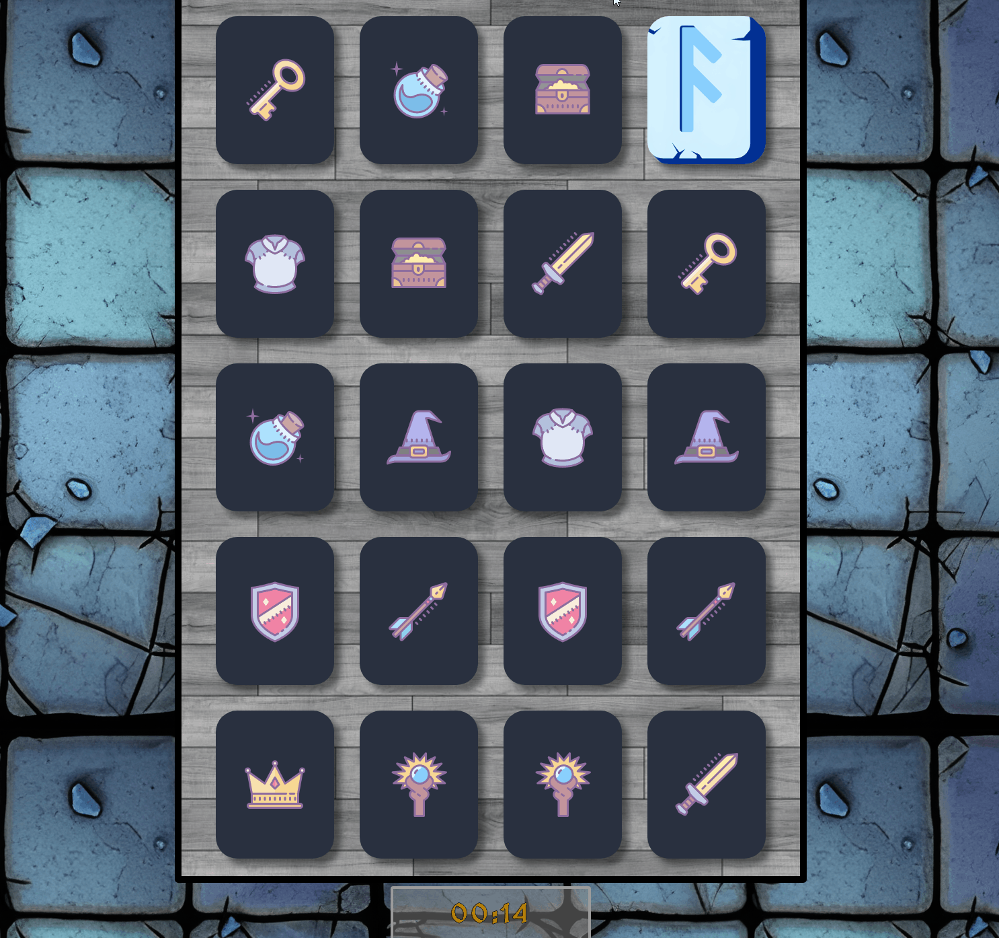
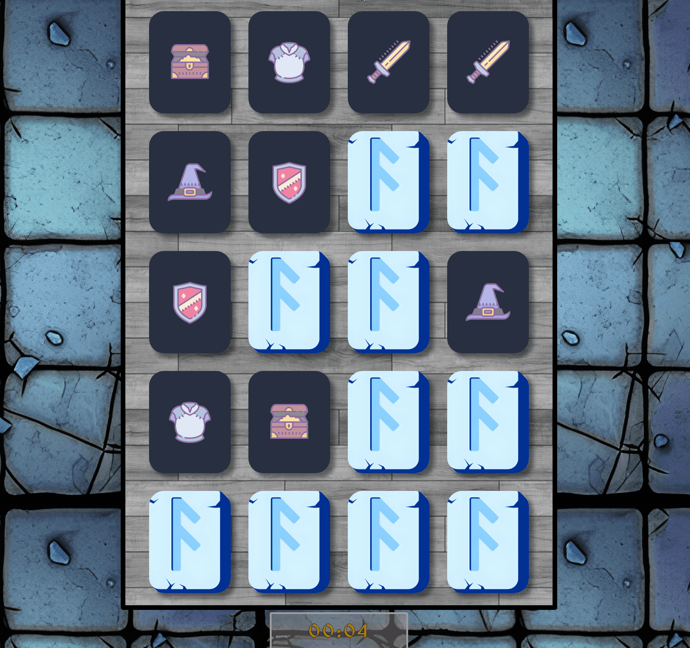

<h1 align="center">Fantasy Matching</h1>
<div align="center">
    
    
    
    <a href="https://twitter.com/luisf_csdev/status/1595238218785591296" target="_blank" rel="noreferrer noopener">
        
    </a>
</div>
<p align="center">🐲 Card matching game that challenges your visual memory, focus, and concentration 🎴</p>

<h4 align="center">
    <a href="#-features">Features</a> •
    <a href="#try-it-yourself">App Demo</a> •
    <a href="#-prerequisites">Prerequisites</a> •
    <a href="#-clone-repository">Clone Repository</a> •
    <a href="#-stacks">Stacks</a> •
    <a href="#excelsior-code--by-luís-felipe">Author</a>
</h4>
<br>

## 📌 Features
- [x] Reusable game logic
- [x] Three levels of difficulties based on time
- [x] Countdown to keep you uptight
- [x] Immersive experience on fullscreen mode
- [x] Ten pair of cards to match
- [x] Game over and win screens
- [x] Supported resolutions: HD, 768p, 900p, FHD, QHD and 4K
<br>

## [🐲TRY IT YOURSELF🐲](https://fantasy-matching-react.netlify.app/)
<div align="center">
    
    
    
</div>

## 
<br>

## 💾 Prerequisites
Then you'll need to have the following tools installed on your machine:
- [GIT](https://git-scm.com/)
- [Node.js](https://nodejs.org/)

Also, use your preferred code editor.
<br>

## 🪢 Clone Repository
```bash
# execute the git clone command
git clone https://github.com/luisf-csdev/login-jwt.git

# enter the project folder
cd fantasy-matching

# install the dependencies
npm install

# finally, run the dev script
npm run dev

# the app will start in port:3000 - access <http://localhost:3000>
```
<br>

## 💽 Stacks
<span>
    <a href='https://reactjs.org/'>
        
    </a>
    <a href='https://nodejs.org/'>
        
    </a>   
    <a href='https://www.javascript.com/'>
        
    </a>
    <a href='https://developer.mozilla.org/en-US/docs/Web/CSS'>
        
    </a>
</span><br><br><br>

<hr>
<div align="center">
<h4>Excelsior code 💙 by Luís Felipe</h4>
 
[🪐 See my LinkedIn 🪐](https://www.linkedin.com/in/luisf-csdev/)
</div>
